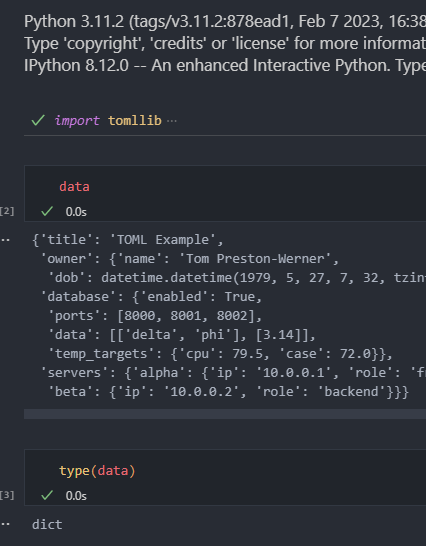

# Read TOML

- [TOML](https://toml.io/en/) är ett intressant format för settings.
Det finns inbyggt stöd för att läsa TOML i [Python 3.11](https://docs.python.org/3/library/tomllib.html)
- Testar här med Python 3.11 (virtual env)
- Installerade denna [extension](https://marketplace.visualstudio.com/items?itemName=bungcip.better-toml) till vscode.
- Efter det får jag syntax highlight på test.toml som innehåller konfigurationen från TOML main page (ovan)
- Kör cellen i test.py och får en dict av datat i test.toml. 
  



Resultatet:

```python
{
    'title': 'TOML Example',
    'owner': {
        'name': 'Tom Preston-Werner',
        'dob': datetime.datetime(1979, 5, 27, 7, 32, tzinfo=datetime.timezone(datetime.timedelta(days=-1, seconds=57600)))
    },
    'database': {
        'enabled': True,
        'ports': [8000, 8001, 8002],
        'data': [['delta', 'phi'], [3.14]],
        'temp_targets': {'cpu': 79.5, 'case': 72.0}
    },
    'servers': {
        'alpha': {'ip': '10.0.0.1', 'role': 'frontend'},
        'beta': {'ip': '10.0.0.2', 'role': 'backend'}
    }
}
```


Funkar 👍